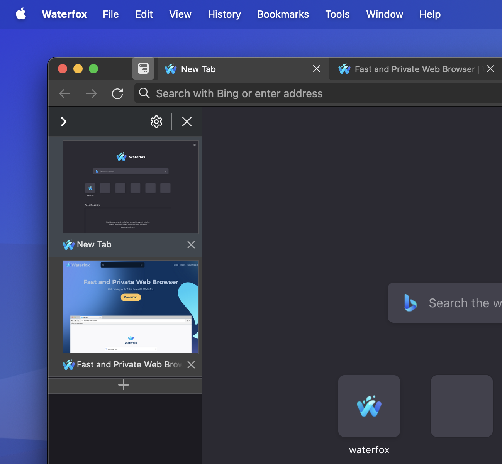
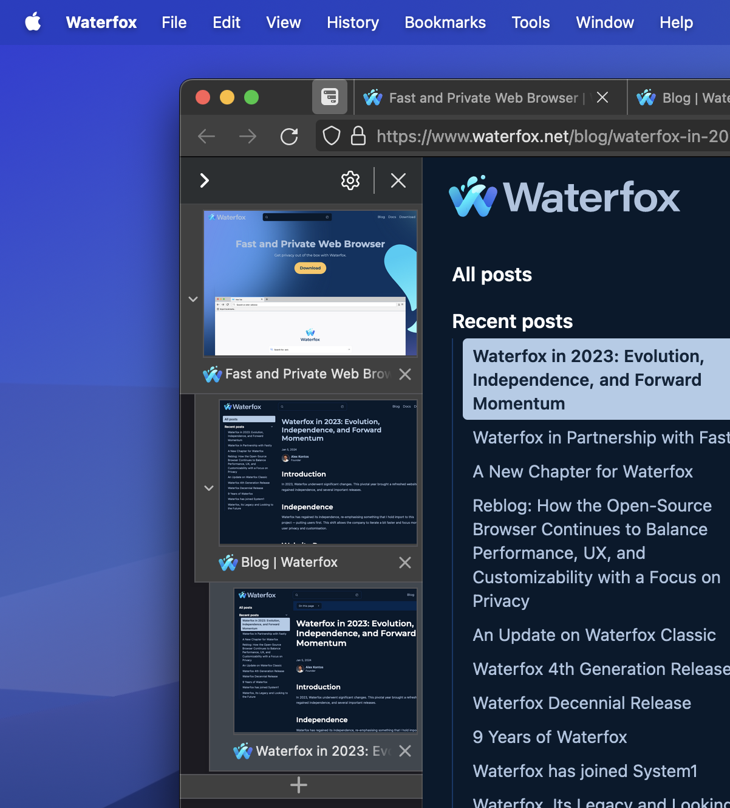
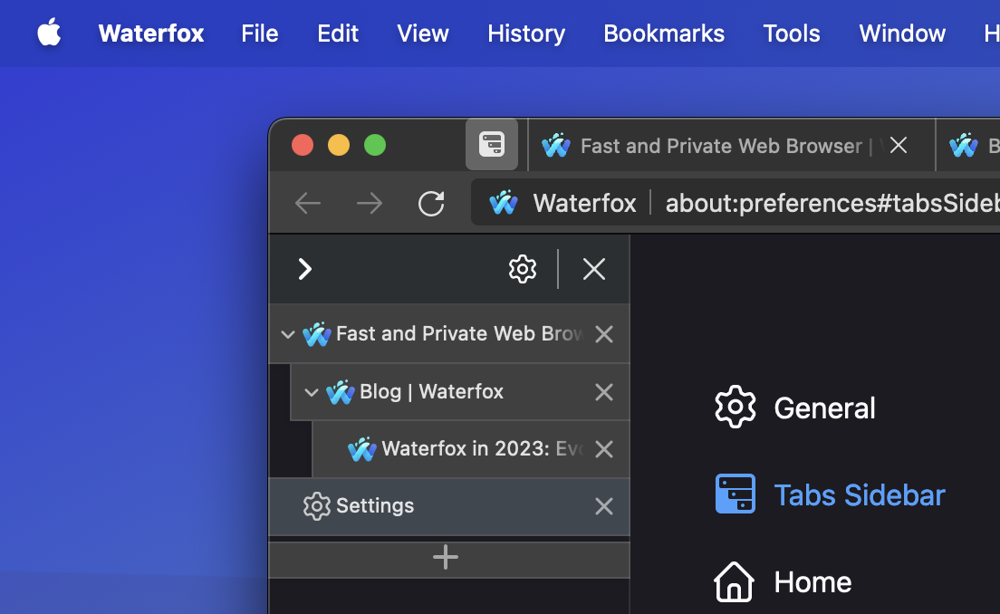
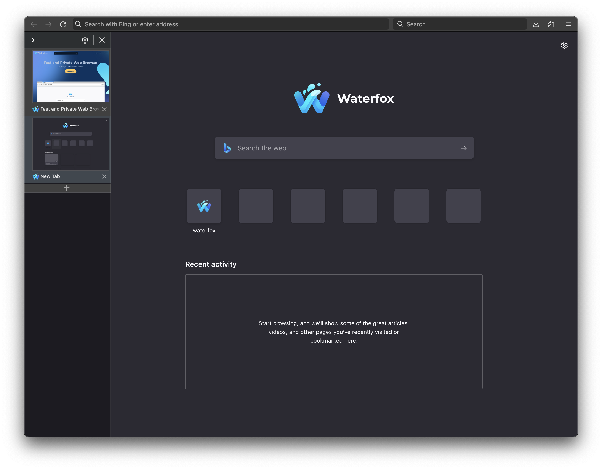

I'm happy to announce a collaboration with Tree Style Tab [(TST)](https://github.com/piroor/treestyletab), the popular Firefox add-on that brings a unique and powerful tab management experience to Waterfox. This partnership,  made possible by the sponsorship of the Waterfox project, is bringing a native sidebar solution for Waterfox users, offering improved, advanced functionality without the need for third-party extensions.

### What's coming to Waterfox?

Inspired by the web browsers of yore, and something I've been wanting for quite a while are tab previews in the vertical sidebar. This will be the default view when enabling the sidebar.

You are also able to toggle the sidebar to be on the left or the right side of the browser window.

Keeping to its namesake, you are also able to have a tree style tab previews.

And of course, when the tabs become too numerous you can collapse them to the familiar text-only mode.

You will also have a myriad of customisations options as one would expect from Waterfox, styling your browser however you see fit.

### Boosting Performance with Virtual Scrolling

One of the key improvements made possible by this collaboration is the integration of **virtual scrolling technology**. This innovative approach addresses a long-standing performance bottleneck in TST. Previously, all tabs, even those hidden, were rendered in the background, consuming significant resources.

#### What's Changed?

With virtual scrolling:

-   **Nodes are only loaded for visible tabs**, dramatically reducing memory usage and improving rendering speed.
-   **Cached sidebar content is no longer needed**, further streamlining performance.
-   This optimization uncovers other potential performance issues, allowing for further refinement.

### Benefits for Everyone

This performance boost benefits both Waterfox users and TST itself:

-   **Waterfox users** experience faster tab switching, smoother scrolling, and reduced memory consumption.
-   **TST development** can now address other performance areas thanks to the virtual scrolling foundation.
-   **In-tab previews in Waterfox** become even more efficient with reduced resource usage.

### Beyond Waterfox: Open Source Collaboration in Action

It's important to remember that while this native integration brings incredible benefits to Waterfox users, it's powered by the collaborative spirit of open source. Tree Style Tab itself is an open-source project, meaning its development thrives on community contributions and shared knowledge.

#### Waterfox's Impact

"[The virtual scrolling architecture] is the largest benefit on the TST project... Current TST keeps DOM nodes as tabs in/around visible area in the sidebar, it improves total performance around rendering and initialization," explains [Yuki Hiroshi](https://github.com/piroor), the TST developer. He further adds, "Introducing virtual scrolling minimizes the RAM usage from such additional contents."

"Now I could develop TST at work time of my employer company, as a task sponsored by the Waterfox project, so I could take enough time to research how we can introduce virtual scrolling to the existing implementation without breakage."

The Waterfox sponsorship allowed the TST developer to focus on crucial features like virtual scrolling and UI enhancements, which significantly improve performance and responsiveness,  particularly noticeable for Waterfox users experiencing these features natively.

While Waterfox played a role in enabling these advancements, it's important to note that the improvements benefit all TST users, regardless of their chosen browser. The virtual scrolling architecture reduces memory usage and enhances rendering speed, making tab management smoother and faster across the board.

Open source thrives on collaboration, and advancements made for one project often benefit the entire community.
