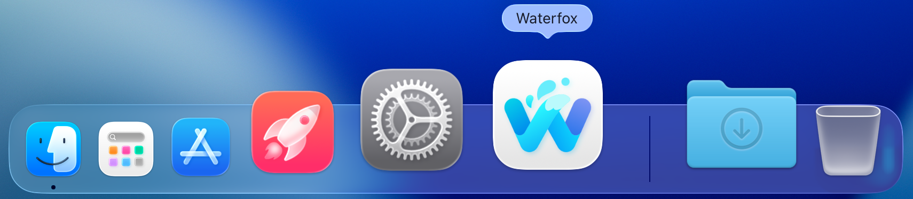
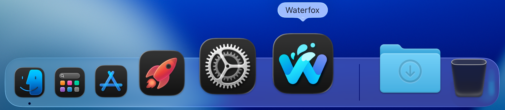
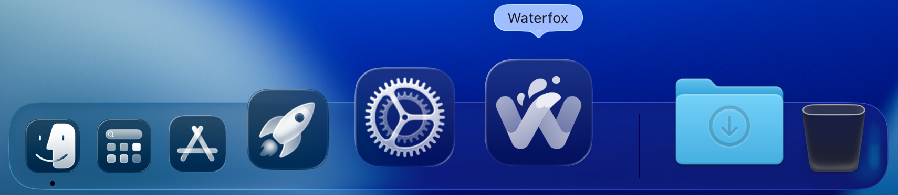
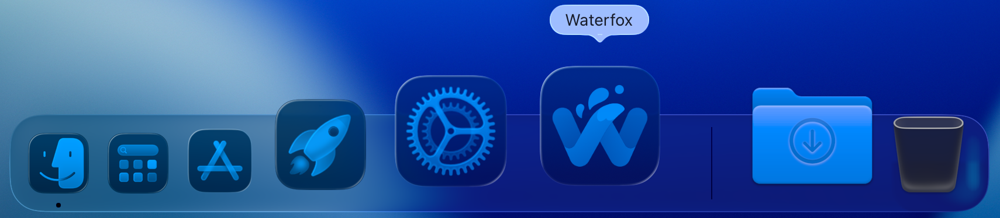

:::danger[macOS Auto-Update Bug]
There is a bug in all previous macOS beta builds where automatic updates do not work. To fix this:

1. **Download the latest beta**
   - [Download beta 3 DMG](https://cdn1.waterfox.net/waterfox/releases/6.6.0-beta-3/Darwin_x86_64-aarch64/Waterfox%206.6.0-beta-3.dmg)

   **Important:** The previous macOS Beta 3 DMG had a notarization issue that has now been fixed. The CDN cache has been flushed to ensure you get the updated version. To verify you have the correct version, check the SHA-512 hash:

   ```
   60490c12e6ca8b37364877153247f7c53a7a21d9316012090510c82101f123d8a87cf712189ffe2c8230bf030dc21f038ac77809fe518cee33fa5d56be694b34
   ```

2. **Delete the BrowserWorks cache**

   **Option A: Using Terminal**
   ```bash
   sudo rm -rf $HOME/Library/Caches/BrowserWorks
   ```

   **Option B: Using Finder**
   - Enable [Hidden Files](https://www.pcmag.com/how-to/how-to-access-your-macs-hidden-files)
   - Navigate to: `Macintosh HD` → `Users` → `[Your Username]` → `Library` → `Caches`
   - Delete the `BrowserWorks` directory

3. **Install Waterfox**
   - Open the downloaded DMG
   - Drag Waterfox to the Applications directory
   - Launch Waterfox

The update system should now work correctly! 🎉
:::

## Changes

*   **Liquid Glass Logo for macOS 26**: Updated logo styling to match modern macOS design standards.

    
    
    
    

*   **Icon Standardization**: Follow same icon standards for older macOS versions and update other platforms to use the slightly modernised version of the logo.
*   **Disabled Speculative Connections**: No longer makes speculative connections when typing addresses in the address bar.
*   **Offline Configuration**: Disabled browser connecting to Mozilla's remote servers to grab settings for things such as blocklists, malware lists etc and instead use bundled, offline copies.
*   **Removed A/B Testing Code**: No longer package A/B testing code that was disabled.

## Bug Fixes

*   **Duplicate Tab Issue**: Fixed issue where duplicate tab would open two duplicates instead of one.
*   **Classic Extensions Support**: Fixed compatibility issue where classic style extensions such as TabMixPlus weren't able to be installed.
