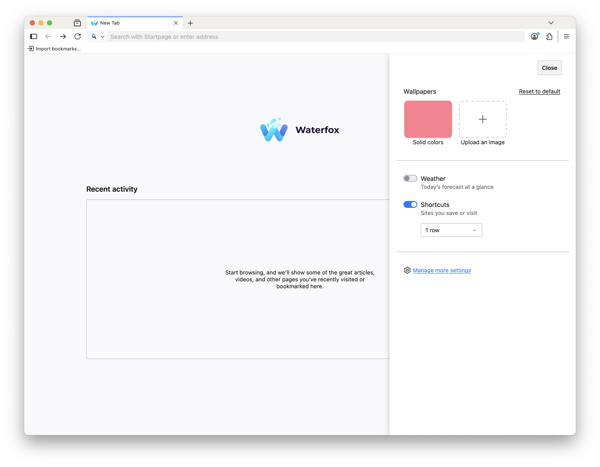
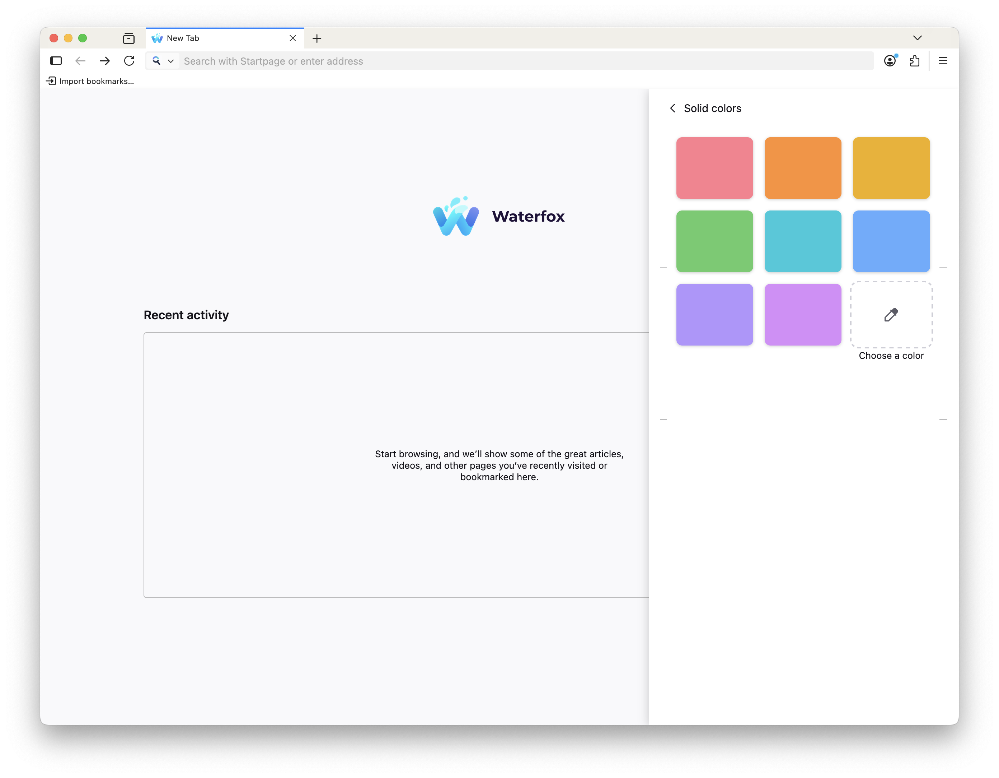

## Changes

* The return of `about:welcome`! If you are a new user or returning with a fresh profile, there will now be a short setup wizard once again.
* You can now toggle to display a search bar on the new tab page.
* You can now toggle to display the weather for your location (opt-in, requires sending your IP to Mozilla, read [more](https://support.mozilla.org/en-US/kb/customize-items-on-firefox-new-tab-page#w_common-questions)).
* You can now set a custom wallpaper on the new tab page - either your own image, predefined colors or a color you pick yourself!

    
    
