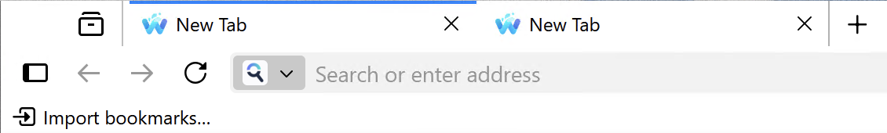
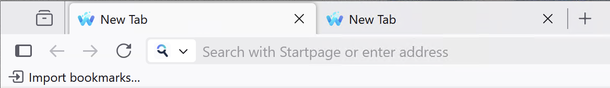
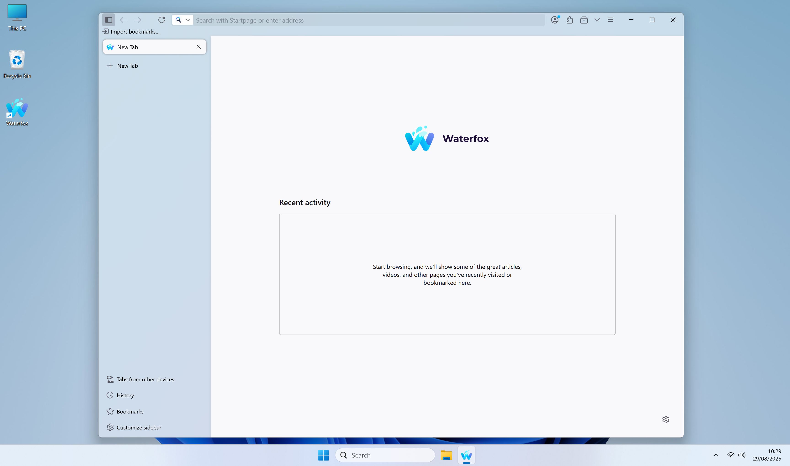
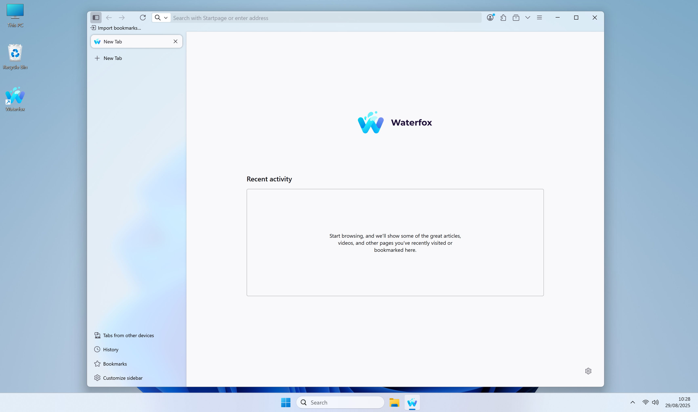
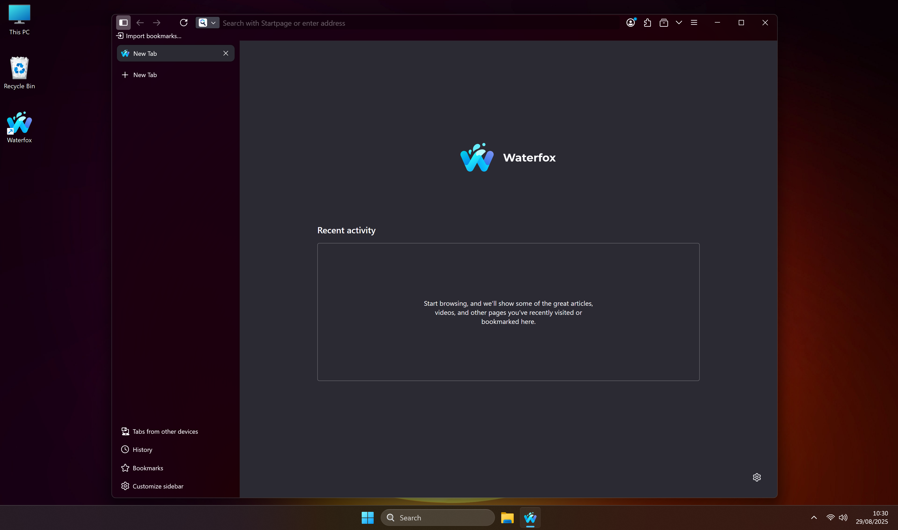
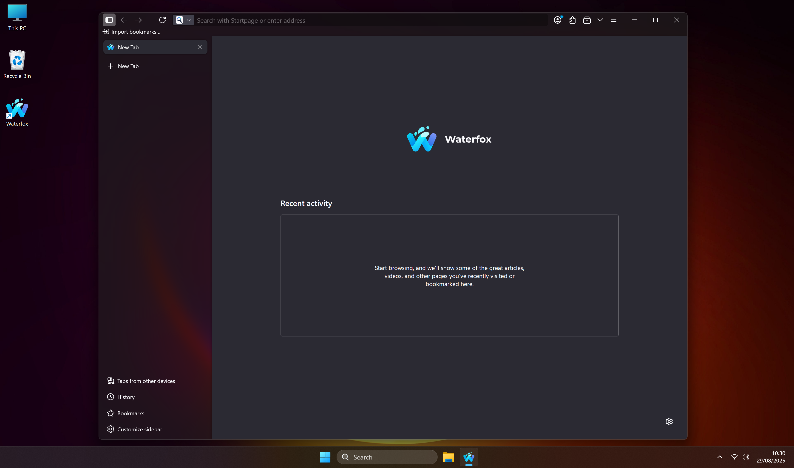

import { Badge } from '@astrojs/starlight/components';

## Fixes

### Theme

:::note
Refinements to the default Waterfox UI will continue as we iron out some kinks from the last release.
:::

- Tab shape has been restored to more closely resemble a physical tab.
- Contrast between active/inactive tabs and the navigation bar is now clearer, making them easier to differentiate.
- The active tab no longer has a blue context line at the top of the tab. You can restore it in Settings → Look & Feel → Interface Components → Tab Bar → Tab Context Line.

Previous Tabs

Improved tabs

- Windows 11 users with supported hardware will now notice subtle translucency matching [Windows Mica](https://learn.microsoft.com/en-us/windows/apps/design/style/mica). If you prefer stronger translucency, you can use [Windows Acrylic](https://learn.microsoft.com/en-us/windows/apps/design/style/acrylic) by setting `widget.windows.mica.toplevel-backdrop` to `2` in `about:config`.

Windows 11 Light Mica

Windows 11 Light Acrylic

Windows 11 Dark Mica

Windows 11 Dark Acrylic

### Tab Groups

#### What’s improved
- New tabs stay in the right group
  - New tabs now reliably open in the same tab group as the “source” tab.
  - Placement options (`after` / `first` / `last`) are applied within the group, so tabs won’t “jump” out of the group at the edges.

- Collapsing the only group works as you expect
  - If you collapse the only group in a window, the browser opens a single ungrouped tab and keeps it ungrouped so the group stays collapsed.
  - This works even if the new tab briefly inherits the group during creation.

- “Cancel auto‑grouping” shortcut is dependable
  - The 1‑second cancel window works consistently.
  - Shortcut defaults: Alt+` on macOS, Ctrl+` on other platforms.
  - It no longer duplicates listeners across windows.
  - Backtick/backquote detection is robust across layouts (the Backquote key is recognized reliably).
  - Exact modifier matching (Ctrl vs Cmd vs Alt vs Shift) prevents accidental activations.

- More resilient and cleaner behavior
  - Grouping is skipped for tabs that land in a different window or have no source group.
  - We clean up timers and listeners when tabs are removed or windows close.
  - Listeners are registered across all current and future browser windows.

#### What didn’t change
- Your existing tab groups and settings are preserved.
- Pinned tabs are never moved into groups.
- Cross‑window grouping is not attempted (only tabs in the same window are grouped).

#### Reminder: Preferences you can use
- Enable/disable auto grouping: `browser.tabs.autoGroupNewTabs`
- Placement: `browser.tabs.autoGroupNewTabs.placement` (`after` | `first` | `last`)
- Delay (1‑second cancel window): `browser.tabs.autoGroupNewTabs.delayEnabled`
- Delay duration (ms): `browser.tabs.autoGroupNewTabs.delayMs`
- Shortcut string: `browser.tabs.autoGroupNewTabs.cancelShortcut`

### Misc

- Recent history and top sites are available again in the address bar; they were disabled by accident in the previous release.
- Linux: Middle‑click paste in the address bar works again. A single click no longer interferes with what you’ve selected elsewhere, so middle‑click pastes the text you expect. Double‑click still selects the full address [<Badge text="Thanks @VULONKAAZ" variant="tip" />](https://www.reddit.com/r/waterfox/comments/1mwf25c/comment/na0ufde/)
- This is the first release that attempts to address a long‑standing issue where, after updating, some users see an empty profile or their old profile appears hidden.

:::tip
If you prefer the old style address bar, you can re-enable it by going to `about:config`, searching for `browser.urlbar.scotchBonnet.enableOverride` and toggling it to `false`.
:::
