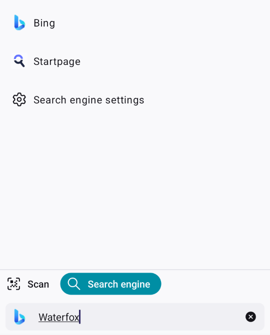

The address bar in Waterfox for Android makes it easy for you to find what you’re looking for. Enter search terms or a specific web address to get search suggestions based on your open tabs, bookmarks, history and search engines — all within the same field.

Keyword search
--------------

### Search with your default search engine

Searching using the address bar will use your default search engine. Enter your search term in the address bar and tap **Go**.

### Search with a different search engine

To switch your search engine for a search:

1.  Begin entering a search term in the address bar.
    
2.  Tap the search engine icon above the address bar and select a different search engine.
    
3.  Complete your search and tap **Go**.

Waterfox suggests relevant search terms and even solutions related to the answer or task you may be looking for. Here are some examples of search suggestions:

Keyword suggestions
-------------------

When you start typing in the address bar, Waterfox suggests relevant popular searches as provided by search engines like Google, Bing, etc. When search suggestions are enabled, the text you enter is sent to the default search engine, which analyzes the words and displays a list of related searches. Tap a suggestion to activate the search.

Site suggestions
----------------

As you type into the address bar, Waterfox may offer relevant site suggestions based on your queries to help you navigate the web. You may see the top three most relevant history suggestions in addition to suggestions based on your open tabs and bookmarks. Tap a suggestion to activate the search.

:::note[Copyright and Licensing]
[Searching with Firefox for Android](https://support.mozilla.org/en-US/kb/searching-firefox-android) by Mozilla Contributors is licensed under [CC BY-SA 3.0 Deed](https://creativecommons.org/licenses/by-sa/3.0/deed.en).

Article originally written by: [Mozinet](https://support.mozilla.org/en-US/user/Mozinet/), [Joni](https://support.mozilla.org/en-US/user/heyjoni/), [Artist](https://support.mozilla.org/en-US/user/Artist/), [Paul](https://support.mozilla.org/en-US/user/plwt/), [Abby](https://support.mozilla.org/en-US/user/aparise/), [Dayani Lucia G.F.](https://support.mozilla.org/en-US/user/dgalindo/)
:::
