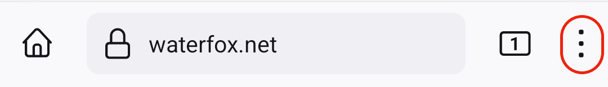

:::note
Waterfox and BrowserWorks are in no way associated with Mozilla. By using a Mozilla account, please make yourself familiar with the [Mozilla Accounts Privacy Notice](https://www.mozilla.org/en-US/privacy/mozilla-accounts/)
:::

Sign in to your Mozilla account on Waterfox for Android to sync your bookmarks, credit cards, history, logins and open tabs across your devices.

## Sign in to your Mozilla account

### Option 1: Pair your mobile browser with Waterfox desktop

To sync your bookmarks, credit cards, history, logins and open tabs with Sync using an existing Mozilla account and QR code:

*   On your Waterfox desktop:
    1.  Access [firefox.com/pair](https://firefox.com/pair).
    2.  Click **Get started**.
*   On your Waterfox for Android app:
    1.  Tap the menu button. 

    2.  Tap Sync and save your data.
    3.  Tap Ready to scan.
    4.  Point your device's camera toward the QR code on your desktop.

### Option 2: Log in with credentials

To sync your bookmarks, credit cards, history, logins and open tabs with Sync by simply signing into your existing Mozilla account:

1.  Tap the menu button. 
    
2.  Tap Sync and save your data.
3.  Tap Use email instead.
4.  Enter your Mozilla account credentials when prompted.
    *   If you do not have an existing Mozilla account, enter your email address when prompted and tap Sign up or sign in to create one. For additional information, see [Access Mozilla services with a Mozilla account](/en-US/kb/access-mozilla-services-Waterfox-account).

## Choose what to sync

1.  Tap the menu button. 

2.  Tap Settings.
3.  Tap your email address.
4.  Put a check mark next to the types of information you want to sync:
    *   Bookmarks
    *   Credit cards
    *   History
    *   Logins
    *   Open tabs

**Note:** Sync is **not an online backup tool** but is designed to enable you to sync browsing data between two or more Waterfox installations.

:::note[Copyright and Licensing]
[How to set up Firefox Sync in Firefox for Android](https://support.mozilla.org/en-US/kb/how-set-firefox-sync-firefox-android) by Mozilla Contributors is licensed under [CC BY-SA 3.0 Deed](https://creativecommons.org/licenses/by-sa/3.0/deed.en).
:::