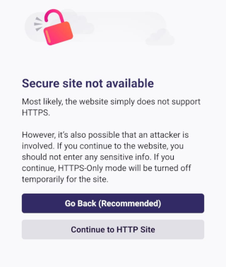

HTTPS-Only Mode is automatically enabled in Waterfox for Android, versions 1.0.0 and later. For every website you visit, Waterfox will automatically establish a secure, encrypted connection over HTTPS whenever possible. This is especially useful when you are using a public Wi-Fi, where you can’t be sure of the integrity of your internet connection. You can disable or enable this feature in your settings.

## What is the difference between HTTP and HTTPS?

[HTTP](https://wikipedia.org/wiki/Hypertext_Transfer_Protocol) stands for Hypertext Transfer Protocol. It is the fundamental protocol for the web and encodes basic interactions between browsers and web servers. The problem with the regular HTTP protocol is that the data transferring from server to browser is not encrypted, meaning data can be viewed, stolen, or altered.

[HTTPS](https://wikipedia.org/wiki/HTTPS) protocols fix this by using either [TLS](https://en.wikipedia.org/wiki/Transport_Layer_Security) (Transport Layer Security) or SSL (Secure Sockets Layer). This creates a secure encrypted connection between the server and the browser, which protects sensitive information.

For example, when HTTPS-Only Mode is active and you visit a site with the `**http**://example.com` URL, Waterfox will silently upgrade to `**https**://example.com`.

## Enable or disable HTTPS-Only Mode

1.  Tap the menu button.
    
2.  Tap Settings.
3.  Tap HTTPS-Only Mode.
4.  Switch the toggle to the left to turn HTTPS-Only Mode off. Switch the toggle to the right to turn it on.
5.  If you turn HTTPS-Only mode on, select Enable in all tabs or Enable only in private tabs.

## Secure site not available

Some websites only support HTTP and the connection cannot be upgraded. If HTTPS-Only Mode is enabled and an HTTPS version of a site is not available, you will see a “Secure site not available” page:

If you tap Continue to HTTP Site, you accept the risks and will visit an HTTP version of the site. HTTPS-Only Mode will be turned off temporarily for that site.

Tap Go Back (Recommended), or your device's back button, if you want to avoid an unencrypted connection.

:::note[Copyright and Licensing]
[HTTPS-Only Mode in Firefox for Android](https://support.mozilla.org/en-US/kb/enhanced-tracking-protection-firefox-android) by Mozilla Contributors is licensed under [CC BY-SA 3.0 Deed](https://creativecommons.org/licenses/by-sa/3.0/deed.en).

Article originally written by: [Michele Rodaro](https://support.mozilla.org/en-US/user/michro/), [Marcelo Ghelman](https://support.mozilla.org/en-US/user/marcelo.ghelman/), [Fabi](https://support.mozilla.org/en-US/user/Fabi.L/), [Abby](https://support.mozilla.org/en-US/user/aparise/), [Denys](https://support.mozilla.org/en-US/user/denyshon/)
:::
