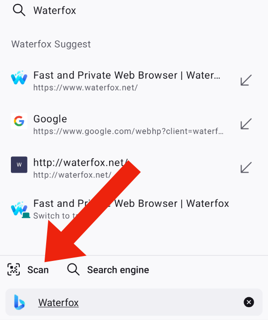

Firefox for Android has a built-in QR code reader in the address bar, this makes it easy to visit a webpage by scanning a QR code.

## How to use the QR code reader

1.  Tap the search bar.
2.  Above the keyboard, tap the Scan icon.

    
    
3.  After scanning you will see the web address, tap **Allow** to visit the site.

:::note[Copyright and Licensing]
[Scan QR codes in Firefox for Android](https://support.mozilla.org/en-US/kb/scan-qr-codes-firefox-android) by Mozilla Contributors is licensed under [CC BY-SA 3.0 Deed](https://creativecommons.org/licenses/by-sa/3.0/deed.en).

Article originally written by: [Tonnes](/en-US/user/Tonnes/), [Roland Tanglao](/en-US/user/rtanglao/), [Biraj Karmakar](/en-US/user/biraj/), [pollti](/en-US/user/pollti/), [Joni](/en-US/user/heyjoni/), [R.S Fatin](/en-US/user/Format009/), [SeulGi Choi](/en-US/user/seulgi/), [Angela Lazar](/en-US/user/anlazar/), [shreyans.jain2](/en-US/user/shreyans.jain2/)
:::