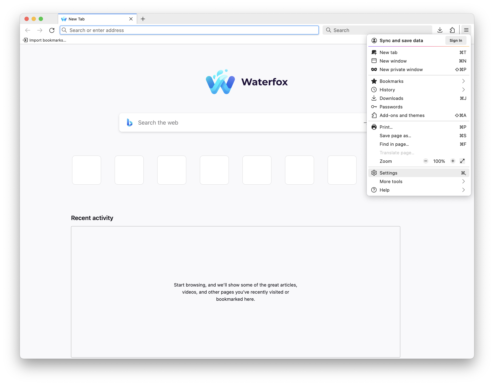
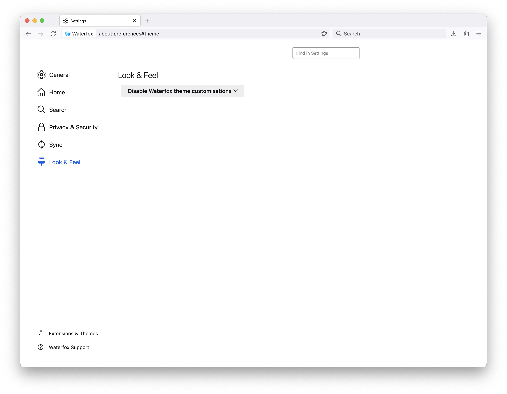

Waterfox comes with various customizations to the look and feel of the browser. If you prefer a more familiar look and feel to the browser we are based on, you can turn these off.

1.  Tap the menu button.
2.  Tap `Settings` or `Preferences` depending on your platform.

3.  Select `Look & Feel` on the navigation pane on the left hand side.

4.  At the top of the page, select the drop down menu that has `Enable Waterfox theme customisations on Waterfox themes` selected by default.
5.  Select `Disable Waterfox Theme Customizations`.

:::note[Copyright and Licensing]
This article is licensed under [CC BY-SA 3.0 Deed](https://creativecommons.org/licenses/by-sa/3.0/deed.en).

Article originally written by: [Alex Kontos](https://www.linkedin.com/in/alex-kontos/)
:::
